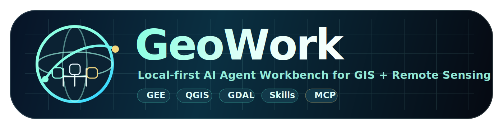

# GeoWork

<p align="center">
  
</p>

<p align="center">
  
</p>

A **local-first desktop AI Agent workbench** for GIS, remote sensing, research reading, GEE/QGIS/GDAL workflows, report writing, Skills, Plugins, MCP connectors, automation, and model routing.

## What GeoWork Can Do

Tackle complex geospatial and scientific workflows through conversation — empowering anyone to analyze the planet 🌏 and produce professional outputs.

| Capability | Scope | Examples |
|---|---|---|
| 🗺️ **QGIS** | **All hundreds of algorithms** in QGIS Processing | Spatial analysis, vector/raster batch processing, format conversion, accessibility analysis... |
| 🛰️ **Google Earth Engine** | **Full GEE Python API** — any remote sensing task you can express | Temporal compositing, classification, change detection, land surface temperature, image download... |
| 🐍 **Python** | Run **arbitrary Python scripts** in an isolated env, full scientific computing stack | Geospatial processing, thematic mapping, deep learning, data science... |
| ✨ **Skills** | On-demand capability packs that **let GeoWork grow as you need** | Pull community-built packs anytime, build the geospatial AI ecosystem together... |
| 🔌 **Plugins** | Local Plugin marketplace for extended functionality | Install, manage, and discover plugins to customize your workspace |
| 🔗 **MCP Connectors** | Model Context Protocol integrations | Connect to external tools, services, and data sources seamlessly |
| 📝 **Report Writing** | Generate professional Office documents | Automated report generation with charts, maps, and formatted tables |
| 📄 **Research Reading** | Paper parsing and literature analysis | Extract insights, summarize papers, and manage research references |
| ⚡ **Automation** | Workflow automation and task scheduling | Chain tools together, automate repetitive geospatial pipelines |
| 🤖 **Model Routing** | Flexible AI model configuration | Switch between models, configure API keys, and optimize costs |

## Architecture

- **Desktop**: Electron + React + TypeScript + Ant Design v5 + CSS Modules + SCSS Modules + CSS Variables
- **Core**: Go Core Runtime with HTTP APIs, SSE events, Tool Registry, security checks, Skills, Plugins, MCP, automation, and model/usage management
- **Geo Worker**: Python FastAPI worker for GEE, GDAL/QGIS-adjacent workflows, paper parsing and Office reports

## Quick Start

### Prerequisites

Before installing GeoWork, ensure the following are on your machine:

- **[QGIS](https://qgis.org/download/)** — desktop GIS app, GeoWork calls its algorithms
- **A Python environment manager** (recommend [Miniconda](https://docs.anaconda.com/miniconda/)) — isolates Python dependencies so workflows don't interfere with each other

> **Tip**: Give GeoWork a **dedicated Python environment** (create a fresh one with Conda / Mamba). The agent will install, uninstall, and upgrade Python packages on its own as it works — a dedicated env keeps your other projects clean and helps the agent run more reliably.

### Installation

```bash
npm install
npm run dev
```

### Individual Checks

```bash
npm run test:core
npm run test:worker
npm test
npm run build
```

## Development

GeoWork follows a modular architecture with three main components:

1. **Electron Desktop App** — The UI layer built with React and TypeScript
2. **Go Core Runtime** — Handles tool orchestration, API management, and security
3. **Python Geo Worker** — Dedicated worker for geospatial and scientific computing tasks

## V1.0 Scope

The implementation follows the `/docx/v0.1.0` Markdown specification and targets the V1.0 development-complete boundary: Research/Data/GeoCode/Analysis/Write modes, 15 navigation modules, 12 official Skills, local Plugin marketplace, MCP management framework, model/API configuration, usage statistics, safety guardrails, automation and full artifact delivery paths.

## Icon Design

GeoWork features a professional visual identity designed for geospatial AI software:

- **Globe + orbital route** — geography, Earth observation and remote-sensing workflow
- **Workbench node blocks** — AI Agent tool orchestration, Skills, Plugins and MCP connectors
- **Topographic/grid background** — GIS analysis, raster/vector processing and spatial computation
- **Full GeoWork wordmark** — stronger product recognition for desktop launcher and README

> **Palette**: Deep Navy `#071225` · Geo Cyan `#8BFFE2` · Signal Blue `#3AD9FF` · Sand Gold `#F4D77E`

## License

GeoWork is local-first and open — see the LICENSE file for details.
